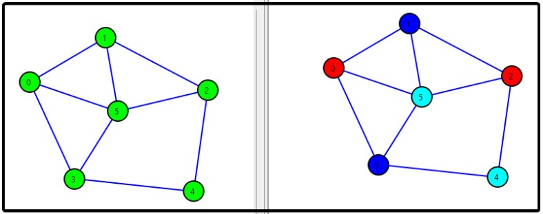
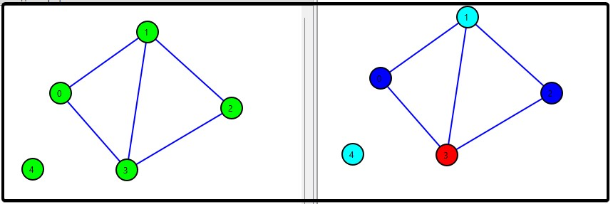
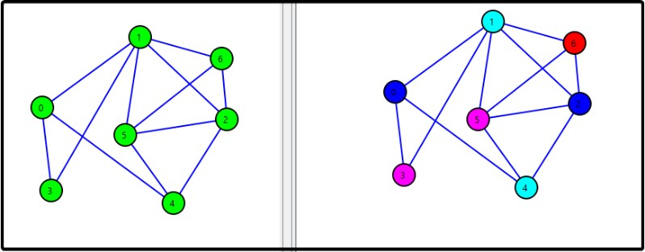
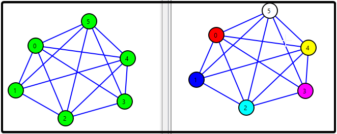
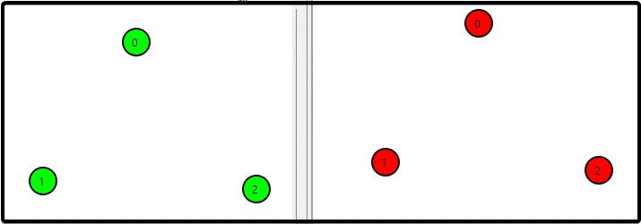

# Contraction graph coloring algorithm
Final part of discrete math's course project. Сontraction graph coloring algorithm. The discription of the algorithm you can find in file "Отчет по курсовой.docx"

##Examples of working







## Getting Started

### Installation

1. Clone repo
   
   ```sh
   git clone https://github.com/zloyaloha/contraction-graph-coloring-algorithm.git
   ```

2. For correct work you need to install some packages requirements.txt with command:
    ```sh
    pip install -r requirements.txt
    ```
3. With application GRAFOID (instruction of it in this repo too) you need to build a graph. After that you need to choose executable file and run the programm. Path to .exe file.
    ```sh
    ~\contraction-graph-coloring-algorithm\main\main.exe
    ```


<p align="right">(<a href="#readme-top">back to top</a>)</p>